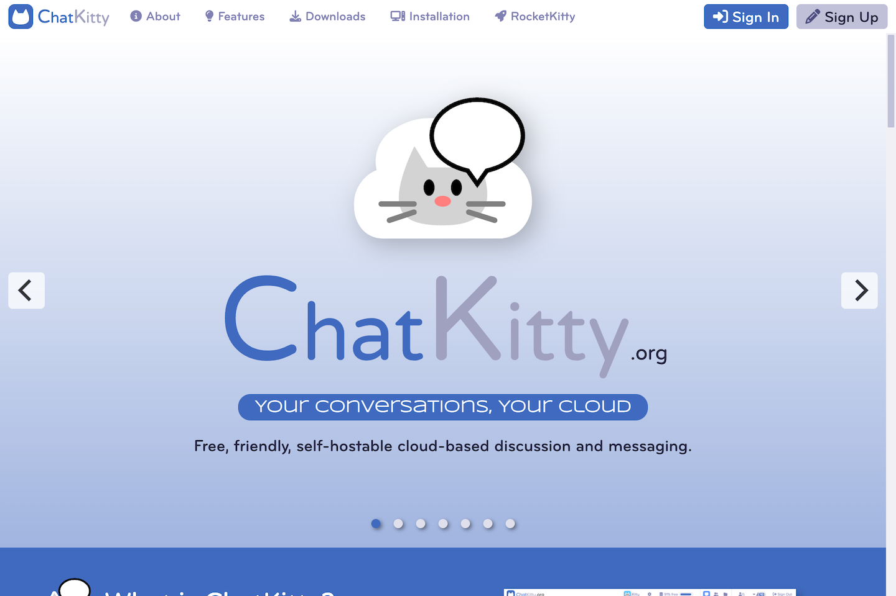
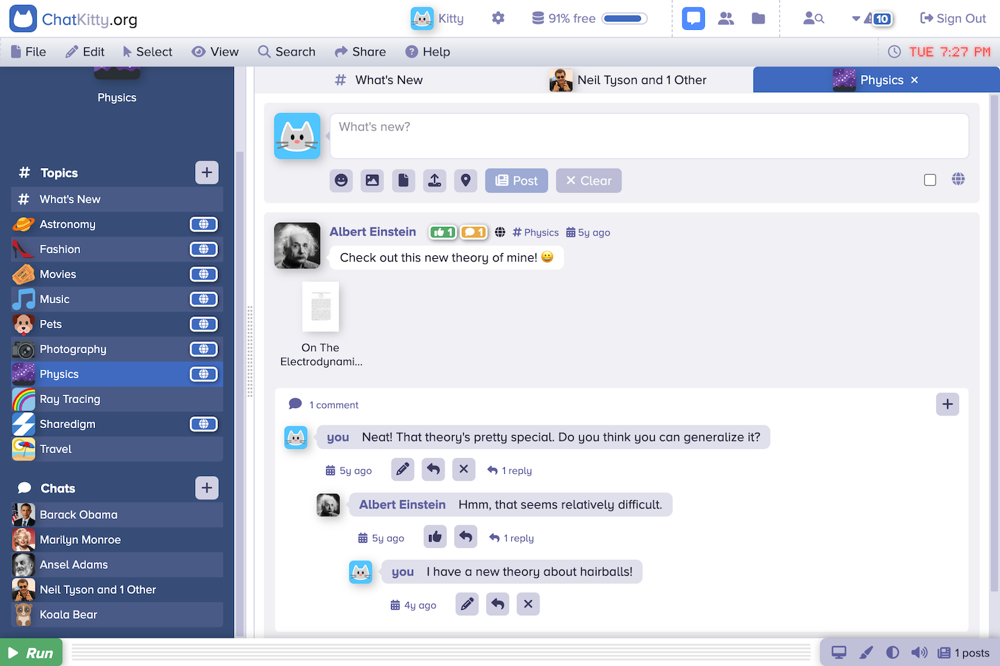

	

# ChatKitty

ChatKitty is a cloud based communications platform that enables you to chat by discussion topic or by direct message. Best of all, you can run it on your own server.

Welcome Screen

Desktop

## Features

- Discussion topics - like social networks that you are likely familiar with.
- Direct messaging - like texting on your phone.
- Easy to install - with a one-step Docker installation.
- Easy to use - works like the desktop and mobile systems you already know.
- Customizable - by users and site administrators.
- Platform independent - desktop or mobile.
- Self-hostable - run on your own server.

## Benefits

- Engage in topic-oriented discussions with multiple participants.
- Have personal, private one-on-one discussions.
- Set up is quick and painless.
- Spend your time using instead of learning the platform.
- Personalize your ChatKitty user experience.
- Run on any connected device.
- Take back control over your data from the tech giants.

## Live Demo

You can create an account and explore the features and benefits of the platform at [www.chatkitty.org](https://www.chatkitty.org).

## Installation

Please follow the instructions in [www.chatkitty.org/#installation](https://www.chatkitty.org/#installation) to install the software on your computer or web server.

## Instructions

See the [Sharedigm User Guide](https://www.sharedigm.com/#help) for instructions on how to use the platform.

## License

Distributed under the Sustainable Use License which allows urestricted use of the software but does not allow you to commercialize it. See [LICENSE.md](LICENSE.md) for more information.

## Contact

mailto:admin@sharedigm.com
